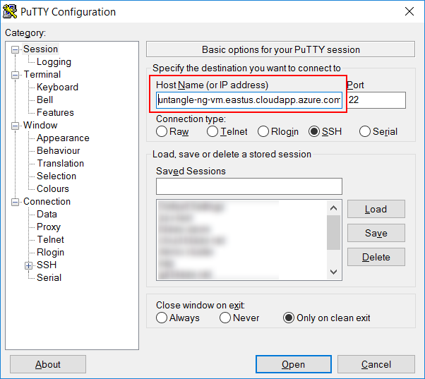

#Deprecated

Untangle is now in the Azure Marketplace.

https://support.untangle.com/hc/en-us/articles/360014955873-How-to-deploy-NG-Firewall-in-Microsoft-Azure?mobile_site=true


Untangle on Azure
===

[Untangle](http://www.untangle.com) has for a long time been a robust Unified Threat Management (UTM) that has secured thousands of networks globally. It started off principally on physical machines, eventually onto virtual hardware with VM's. With the rise of the cloud now, virtual machines are now being deployed on popular cloud providers like Amazon AWS and Microsoft Azure. Azure in and of itself supports a variety of different operating systems and even lets users bring their own, and Untangle can be one of those.

Untangle on Azure uses pretty much the same architecture that it uses for VM's 	


## Prerequisites

* **Powershell** -- Perhaps the best way to deploy Azure Resource Management and VHD's to Azure is to use PowerShell with the Azure for Powershell installed. If you're using a Mac or Linux, you can still use PowerShell -- simply [download and install it on your computer](http://www.howtogeek.com/267858/how-to-install-microsoft-powershell-on-linux-or-os-x/).

* **Powershell Azure Modules** -- You'll also need the [Azure Modules for Powershell](https://docs.microsoft.com/en-us/powershell/azureps-cmdlets-docs/) to run the commandlets referenced in this guide.

* **VHD Image** -- Before provisioning Untangle on Azure, the Untangle Virtual Hard Drive (VHD) needs to [be created](./create-untangle-vm.md).

* **Putty** -- If you're using Windows, you'll [need Putty to connect](http://www.chiark.greenend.org.uk/~sgtatham/putty/download.html) to Untangle remotely.


## Setting up Azure on Untangle

1. Login to Azure. This will launch web view that will allow you to login to your Azure Account

	````
	Login-AzureRmAccount
	````

1. List your subscription.

	````
	Get-AzureRmSubscription
	````

	This will output a list of subscriptions:

	````
	SubscriptionName : Your Subscription Name 1
	SubscriptionId   : xxx...
	TenantId         : yyy...
	State            : Enabled

	SubscriptionName : Your Subscription Name 2
	SubscriptionId   : xxx...
	TenantId         : yyy...
	tate            : Enabled
	````

1. Select a subscription. Substitute **Subscription Name** with the name of your subscription.

	````
	Get-AzureRmSubscription –SubscriptionName "Subscription Name" | Select-AzureRmSubscription
	````

1. Create a **Resource Group**. 

	* The **Name** can be any name you like, but you'll need it for later commands. The example below uses **untangle-utm**.
	* Pick a **Location** for the resource group from one of [Microsoft's data centers](https://azure.microsoft.com/en-us/regions/). Copy and Paste the region name into the Location. The example below is using **East US**

	````
	New-AzureRmResourceGroup -Name "untangle-utm" -Location "East US"
	````

1. Create a **Storage Account**.

	* The **ResourceGroupName** needs to be the Name of the Resource group created in step 4 which in this case is **untangle-utm**
	* The **Name** of the storage account needs to be all lower case letters and/or numbers. It us used as part of a URL, so the rules that apply to domain names apply to the name of the account. This example is using **untanglestore**.
	* **Location** should match the same location set in step 4, which in this case is **East US**.
	* **SkuName** and **Kind** parameters can be left as is. The Sku though can be changed for better performing hardware, but it isn't necessary for Untangle.

	````
	New-AzureRmStorageAccount -ResourceGroupName untangle-utm -Name untanglestore -Location "East US" -SkuName "Standard_LRS" -Kind "Storage"
	````

1. Upload the VHD.

	* The **ResourceGroupName** needs to be the Name of the Resource group created in step 4 which in this case is **untangle-utm**
	* The **Destination** is the URL of the VHD. Note, the first part of the domain name in the URL is the name of the Storage Account created in step 5, which in this case is **untanglestore**.
	* The **LocalFilePath** is the path to the VHD file. If you created the VM using VirtualBox yourself, the path is likely your User folder -> VirtualBox Vm's -> Untangle VM -> Untangle VM.VHD. On Windows, this would be "C:\users\username\VirtualBox VMs\Untangle VM\Untangle VM.vhd" and on Mac or Linux, "/home/username/VirtualBox VMs/Untangle VM/Untangle VM.vhd".
	
	````
	Add-AzureRmVhd -ResourceGroupName untangle-utm -Destination "https://untanglestore.blob.core.windows.net/vhds/untangle-ng.vhd" -LocalFilePath Untangle-NG.vhd
	````

	The upload will calculate a hash on the file then upload it. You can watch the progress in the terminal window. The upload process converts the VHD file from a dynamically allocated file to a fixed size file in transit and uploads it without consuming any extra bandwidth beyond what is necessary for the file. 

	````
	 Uploading
  	  75.6% complete; Remaining Time: 00:01:25; Throughput: 59.6Mbps
    [ooooooooooooooooooooooooooooooooooooooooooooooooooooooooooooo                                ]
  	  00:01:25 remaining.
	````

1. Now that the VHD is deployed, you can deploy the template to Azure with the button below or continue to step 8 and use Powershell. If you use the template on Powershell, skip to step 10.

	<a href="https://portal.azure.com/#create/Microsoft.Template/uri/https%3A%2F%2Fraw.githubusercontent.com%2Ftheonemule%2Funtangle-azure%2Fmaster%2Funtangle.json" target="_blank"></a>

1. Edit the **untangle.parameters.json** file.

	* Set **vmName** value to whatever you want to call the VM. This one is called **untangle-ng-vm**.
	* Set the value for **osDiskVhdUri** to the URL for the VHD you uploaded in step 6. It should match the **Destination** parameter, which in this case is "https://untanglestore.blob.core.windows.net/vhds/untangle-ng.vhd".
	* Set the **vmSize** the appropriate size for your load. A [list of these can be found here](https://docs.microsoft.com/en-us/azure/virtual-machines/virtual-machines-windows-sizes). The **Standard_A2_v2** size used here is a dual core machine with 4GB of RAM. which is sufficient for running Untangle in many cases. The size of the VM has to at least support 2 NIC's for Untangle to work.
	

	Once the edits are complete, save the file.

1. Deploy the Template to Create the VM and associated components. 

	* The **Name** of the deployment can be whatever.
	* The **ResourceGroupName** needs to be the Name of the Resource group created in step 4 which in this case is **untangle-utm**.
	* **Mode** should be left as **Incremental**
	* **TemplateFile** should be the path to the untangle.json file.
	* **TemplateParameterFile** should be the name of the file edited in step 7.
	* **Force** and **Verbose** should be left included.

	````	
	New-AzureRmResourceGroupDeployment -Name "untangle-fw" -ResourceGroupName "untangle-utm"  -Mode Incremental  -TemplateFile untangle.json  -TemplateParameterFile untangle.parameters.json  -Force -Verbose
	````

	Watch the output for progress.

1. Connecting to Untangle from a local box (Mac or Linux)

	If you're on a Mac or Linux box, connecting to untangle is pretty straight forward. The output from the creation process showed an SSH command for connecting to Untangle. Add the local port forward to the command.

	````
	ssh root@untangle-ng-vm.eastus.cloudapp.azure.com -L 8080:127.0.0.1:80
	````

	The terminal will then prompt your for your password. If you downloaded the image, the password is "passwd", otherwise, use the password that you used when you created the VM on VirtualBox.


1. Connecting to Untangle from a local box (Windows)

	If you're using Windows, you'll need Putty.

	 * Note the output from step none for **sshCommand**. 

	````
	ssh root@untangle-ng-vm.eastus.cloudapp.azure.com
	````

	Copy the portion after the root@. This is the host name of the VM. In this case, the host name is **untangle-ng-vm.eastus.cloudapp.azure.com**


	* Open Putty, and set the **Host Name** to the host name from the SSH command.

	

	* Add a tunnel by going to **Connection** -> **SSH** -> **Tunnels**. Set the **Source Port** to **8080** and the **Destination** to **127.0.0.1:80**	

	

	* Back on **Session**, name the session and **Saved Sessions**, click **Save**, then click **Open**.

	

	* The terminal will prompt for a user. Type in **root**.
	* Supply the password you used when you created the VM in VirtualBox or use **passwd** if you downloaded the image.

1. Connect to Untangle. Open a Browser and point the browser to http://localhost:8080. This will load the Account Login page on Untangle on Azure. If you downloaded the image, change the Admin password to make it more secure.


	


